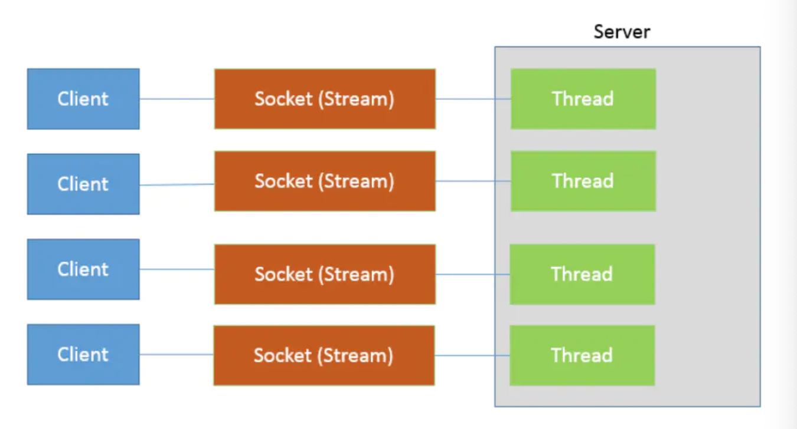
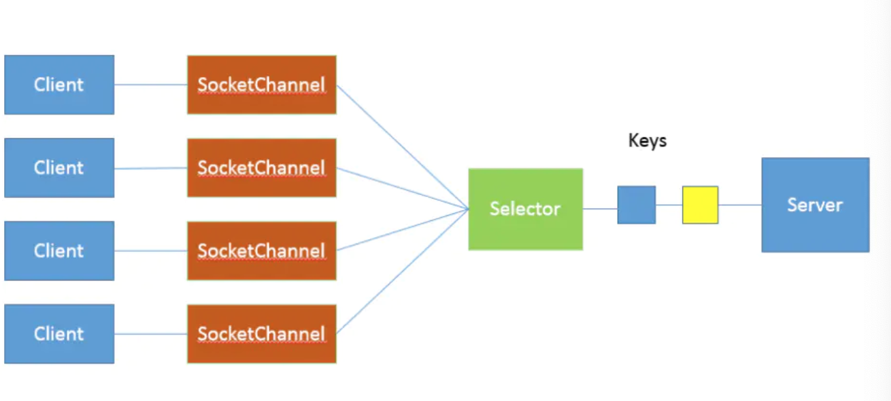

# 10个http连接，BIO和NIO所需线程问题

## 1. 问题

**BIO 和 NIO 作为 Server 端，当建立了 10 个连接时，分别产生多少个线程？**

**答案**：

- 传统的IO 也就是BIO

  传统的IO 也就是BIO 是同步线程阻塞的，所以**每个连接都要分配一个专用线程来处理请求**，这样10个连接就会创建10个线程去请求

- NIO

  NIO 是一种同步非阻塞的I/O 模型，他的**核心技术是多路复用**，可以使用一个链接上的不同通道来处理不同的请求，所以即使有10个连接，对于NIO来说，开启一个线程就够了

## 2.BIO代码实现

```java

public class BIOServer extends Thread {
    private ServerSocket serverSocket;

    public int getPort() {
        return serverSocket.getLocalPort();
    }

    @Override
    public void run() {
        try {
            serverSocket = new ServerSocket(0);
            while (true) {
                Socket socket = serverSocket.accept();
                RequestHandler requestHandler = new RequestHandler(socket);
                requestHandler.start();
            }
        } catch (IOException e) {
            e.printStackTrace();
        } finally {
            if (serverSocket != null) {
                try {
                    serverSocket.close();
                } catch (IOException e) {
                    e.printStackTrace();
                }
            }
        }
    }

    public static void main(String[] args) throws IOException {
        DemoServer server = new DemoServer();
        server.start();
        for (int i = 0; i < 100; i++) {
            try (Socket client = new Socket(InetAddress.getLocalHost(), server.getPort())) {
                BufferedReader bufferedReader = new BufferedReader(new InputStreamReader(client.getInputStream()));
                bufferedReader.lines().forEach(s -> System.out.println(s));
            }
        }
    }
}

// 简化实现，不做读取，直接发送字符串
class RequestHandler extends Thread {
    private Socket socket;

    RequestHandler(Socket socket) {
        this.socket = socket;
    }

    @Override
    public void run() {
        try (PrintWriter out = new PrintWriter(socket.getOutputStream());) {
            out.println("当前线程：" + Thread.currentThread().getName() + "      Hello world!");
            out.flush();
        } catch (Exception e) {
            e.printStackTrace();
        }
    }
}


```

- 服务器端启动serverSocket，端口0表示自动绑定一个空闲端口
- 调用accept方法，阻塞等等客户端连接
- 利用 Socket 模拟了一个简单的客户端，只进行连接、读取、打印
- 当连接建立后，启动一个单独线程负责回复客户端请求

这样，一个简单的 Socket 服务器就被实现出来了。



## 3. NIO 代码实现

```
public class NIOServer extends Thread {
    public void run() {
        try (Selector selector = Selector.open();
             ServerSocketChannel serverSocket = ServerSocketChannel.open();) {// 创建 Selector 和 Channel
            serverSocket.bind(new InetSocketAddress(InetAddress.getLocalHost(), 8888));
            serverSocket.configureBlocking(false);
            // 注册到 Selector，并说明关注点
            serverSocket.register(selector, SelectionKey.OP_ACCEPT);
            while (true) {
                selector.select();// 阻塞等待就绪的 Channel，这是关键点之一
                Set<SelectionKey> selectedKeys = selector.selectedKeys();
                Iterator<SelectionKey> iter = selectedKeys.iterator();
                while (iter.hasNext()) {
                    SelectionKey key = iter.next();
                   // 生产系统中一般会额外进行就绪状态检查
                    sayHelloWorld((ServerSocketChannel) key.channel());
                    iter.remove();
                }
            }
        } catch (IOException e) {
            e.printStackTrace();
        }
    }
    private void sayHelloWorld(ServerSocketChannel server) throws IOException {
        try (SocketChannel client = server.accept();) {          client.write(Charset.defaultCharset().encode("Hello world!"));
        }
    }
   // 省略了与前面类似的 main
}


```

- 首先，通过Selector.open()创建一个Selector，作为类似调度员的角色
- 然后，创建一个ServerSocketChannel，并且向Selector注册，通过指定SelectionKey.OP_ACCEPT，告诉调度员，它关注的是新的连接请求。注意：为什么我们要明确配置非阻塞模式呢？这是因为阻塞模式下，注册操作是不允许的，会抛出 IllegalBlockingModeException 异常。
- Selector 阻塞在select操作，当有Channel发生接入请求，就会被唤醒
- 在sayHelloWorld方法中，通过SocketChannel和Buffer进行数据操作，在本例中是发送了一段字符串。

可以看到，在前面两个样例中，IO 都是同步阻塞模式，所以需要多线程以实现多任务处理。而NIO 则是利用了单线程轮询事件的机制。通过高效的定位就绪的Channel，来决定做什么，仅仅select阶段是阻塞的。可以有效避免大量客户端连接时。频繁线程切换带来的问题。应用的扩张能力有了非常大的提高。下面这张图对这种实现思路进行了形象的说明

