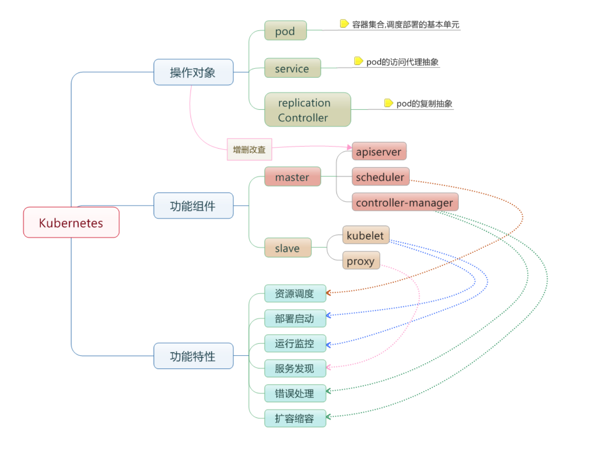

# Kubernetes基本概念

## 1. 基本概念

- 节点（`Node`）：一个节点是一个运行 Kubernetes 中的主机
- 容器组（`Pod`）：一个Pod对应于由若干容器组成的一个容器组，同个组内的容器共享一个存储卷（volume）
- 容器组生命周期（`pos-states`）: 包含所有容器状态集合、包括容器组状态类型，容器组生命周期、事件、重启策略、以及replication controllers。

- Replication Controllers：主要负责制定数量的pod 在同一时间一起运行
- 服务（services）: 一个 Kubernetes 服务是容器组逻辑的高级抽象，同时也对外提供访问容器组的策略。
- 卷（`volumes`）: 一个卷就是一个目录，容器对其有访问权限
- 标签（`labels`）: 标签是用来连接一组对象的，比如容器组，标签可以被用来组织和选择子对象
- 接口权限（`accessing_the_api`）: 端口，IP 地址和代理的防火墙规则
- web界面（`ux`）: 用户可以通过web界面操作 Kubernetes。
- 命令行操作（`cli`）: kubecfg 命令。

## 参考文章

[k8s基本概念](https://yeasy.gitbooks.io/docker_practice/kubernetes/concepts.html)