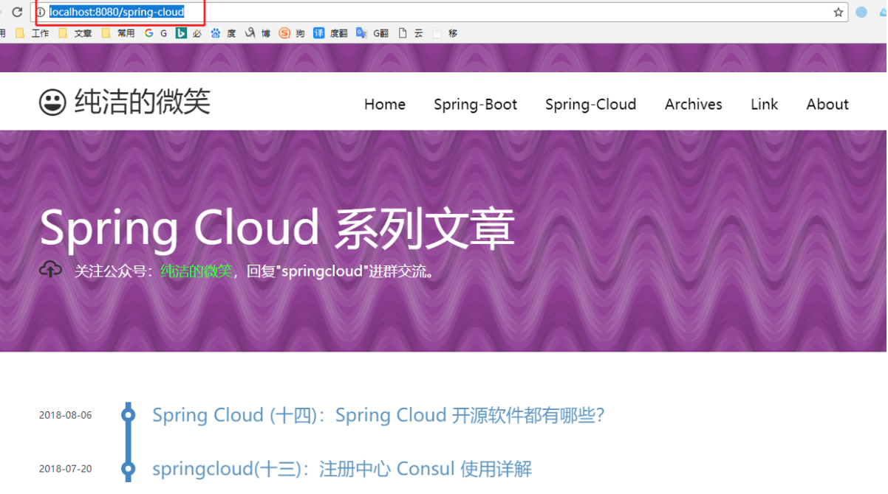

# Spring Cloud GateWay实战

## 1. 网关路由有两种配置方式

- 在配置文件 yml 中配置
- 通过 `@Bean` 自定义 RouteLocator，在启动主类 Application 中配置

这两种方式是等价的，建议使用 yml 方式进配置。

## 2. POM依赖

```xml
<dependency>
	<groupId>org.springframework.cloud</groupId>
	<artifactId>spring-cloud-starter-gateway</artifactId>
</dependency>
```

Spring Cloud Gateway 是使用 netty+webflux 实现因此不需要再引入 web 模块。

## 3. 测试转发请求

```
server:
  port: 8080
spring:
  cloud:
    gateway:
      routes:
      - id: neo_route
        uri: http://www.ityouknow.com
        predicates:
        - Path=/spring-cloud
```

各字段含义如下：

- id：我们自定义路由ID，保持唯一
- uri：目标服务地址
- predicates：路由条件，接受一个输入参数，返回一个布尔值结果。该接口包含多种默认方法来将predicates 组合成其他复杂的逻辑（比如：与，或，非）。
- filters：过滤规则，本示例暂时没用

上面这段配置的意思是，配置了一个id为 neo_route 的路由规则，当访问地址 `http://localhost:8080/spring-cloud`时会自动转发到地址：`http://www.ityouknow.com/spring-cloud`。配置完成启动项目即可在浏览器访问进行测试，当我们访问地址`http://localhost:8080/spring-cloud` 时会展示页面展示如下



证明页面转发成功。

转发功能同样可以通过代码来实现，我们可以在启动类 GateWayApplication 中添加方法 `customRouteLocator()` 来定制转发规则。

```java
@SpringBootApplication
public class GateWayApplication {

	public static void main(String[] args) {
		SpringApplication.run(GateWayApplication.class, args);
	}

	@Bean
	public RouteLocator customRouteLocator(RouteLocatorBuilder builder) {
		return builder.routes()
				.route("path_route", r -> r.path("/about")
						.uri("http://ityouknow.com"))
				.build();
	}

}
```

以上只是一个简单实现，更多[路由规则](http://www.ityouknow.com/springcloud/2018/12/12/spring-cloud-gateway-start.html)