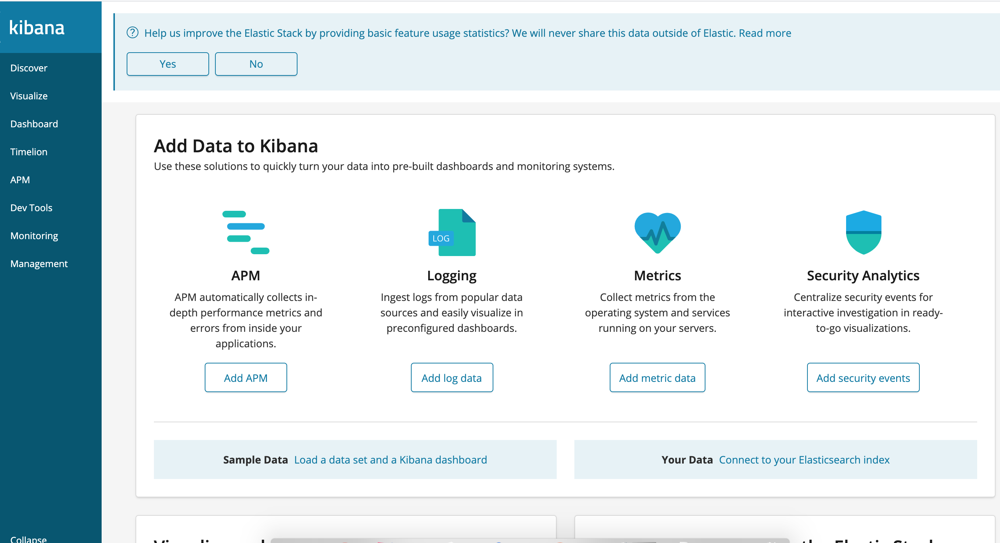

# ELK日志收集

## 1. 背景

各个微服务系统的日志都保存在各自指定的目录中，如果这些微服务部署在不同的服务器上，那么日志文件也是**分散在各自的服务器上**。分散的日志不利于我们快速通过日志定位问题，我们可以借助ELK来**收集各个微服务系统的日志并集中展示**。

## 2. 简介

ELK即Elasticsearch、Logstash和Kibana首字母缩写。Elasticsearch用于存储日志信息，Logstash用于收集日志，Kibana用于图形化展示。

## 3. Docker Compose搭建ELK

### 3.1 增加内存

Elasticsearch默认使用mmapfs目录来存储索引。操作系统默认的mmap计数太低可能导致内存不足，我们可以使用下面这条命令来增加内存：

```
sysctl -w vm.max_map_count=262144
```

[官方文档](https://www.elastic.co/guide/en/elasticsearch/reference/current/vm-max-map-count.html)

### 3.2 创建Elasticsearch数据挂载路径：

```
mkdir -p /elk/elasticsearch/data
```

### 3.3 对该路径授予777权限

```
chmod 777 /elk/elasticsearch/data
```

### 3.4 创建Elasticsearch插件挂载路径：

```
mkdir -p /elk/elasticsearch/plugins
```

### 3.5 创建Logstash配置文件存储路径：

```
mkdir -p /elk/logstash
```

### 3.6 创建配置文件

在/elk/logstash路径下创建`logstash-elk.conf`配置文件

```
vim /elk/logstash/logstash-elk.conf
```

内容如下所示：

```
input {
  tcp {
    mode => "server"
    host => "0.0.0.0"
    port => 4560
    codec => json_lines
  }
}
output {
  elasticsearch {
    hosts => "es:9200"
    index => "febs-logstash-%{+YYYY.MM.dd}"
  }
}
```

### 3.7 创建ELK Docker Compose文件存储路径

```
mkdir -p /elk/DockerCompos
```

在该目录下创建`docker-compose.yml`文件：

```
vim /elk/DockerCompos/docker-compose.yml
```

内容如下所示：

```
version: '3'
services:
  elasticsearch:
    image: elasticsearch:6.4.1
    container_name: elasticsearch
    environment:
      - "cluster.name=elasticsearch" #集群名称为elasticsearch
      - "discovery.type=single-node" #单节点启动
      - "ES_JAVA_OPTS=-Xms512m -Xmx512m" #jvm内存分配为512MB
    volumes:
      - /febs/elasticsearch/plugins:/usr/share/elasticsearch/plugins
      - /febs/elasticsearch/data:/usr/share/elasticsearch/data
    ports:
      - 9200:9200
  kibana:
    image: kibana:6.4.1
    container_name: kibana
    links:
      - elasticsearch:es #配置elasticsearch域名为es
    depends_on:
      - elasticsearch
    environment:
      - "elasticsearch.hosts=http://es:9200" #因为上面配置了域名，所以这里可以简写为http://es:9200
    ports:
      - 5601:5601
  logstash:
    image: logstash:6.4.1
    container_name: logstash
    volumes:
      - /febs/logstash/logstash-febs.conf:/usr/share/logstash/pipeline/logstash.conf
    depends_on:
      - elasticsearch
    links:
      - elasticsearch:es
    ports:
      - 4560:4560
```

切换到  /elk/DockerCompos 目录下，使用如下命令

### 3.8 启动

```
docker-compose up -d
```

第一次启动的时候，Docker需要拉取ELK镜像，过程可能稍慢，耐心等待即可。成功启动后，观察容器运行情况：

### 3.9 查看启动状态

```
docker ps -a
```


三个状态都为up就证明启动成功了

- 如遇到状态为exit的，请查看当前内存是否足够

## 4. Logstash中安装json_lines插件

### 4.1 进入Logstash容器

使用如下命令进入到Logstash容器中：

```
docker exec -it logstash /bin/bash
```

### 4.2 安装步骤

- 切换到/bin目录
- 安装json_lines插件
- 退出


## 5. 效果

使用浏览器访问 http://120.79.200.111:5601/ 可以看到Kibana管理界面：

