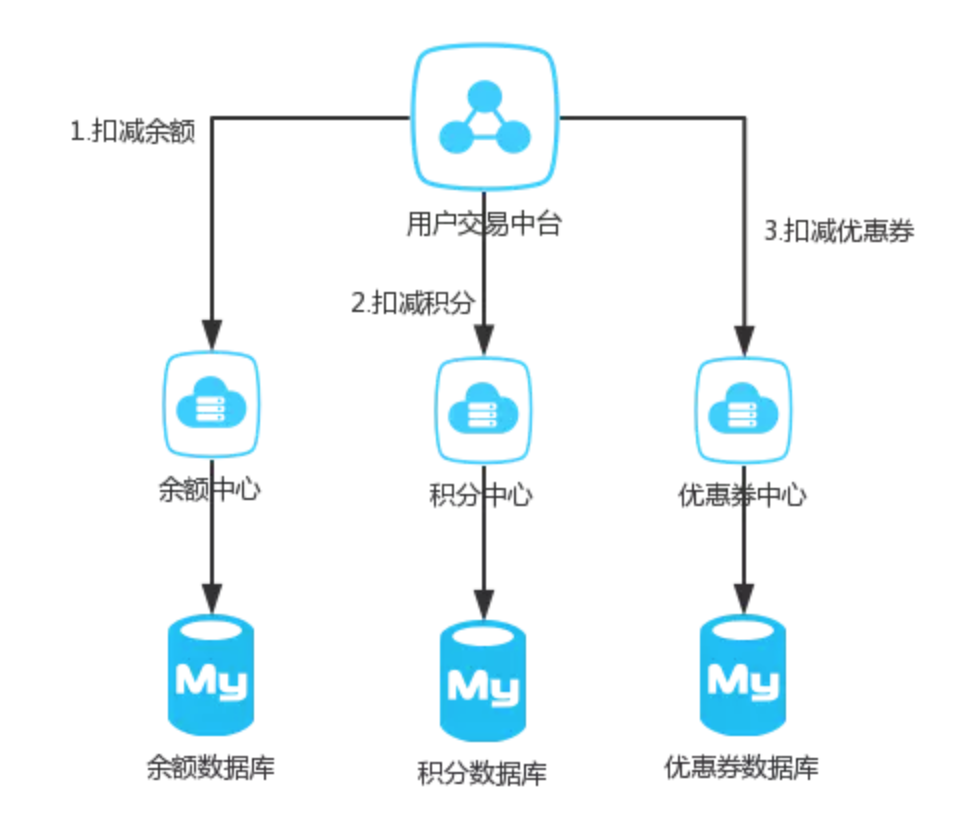
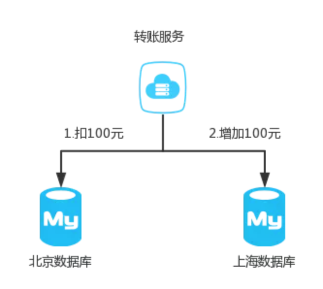

# 分布式事务

## 1. 事务相关理论基础

**数据库本地事务ACID**

- A：原子性（Atomicity）

  要么都做，要么都不做

- C:一致性(Consistency)

  在一个事务执行之前和执行之后数据库都必须处于一致性状态

- I:隔离性(Isolation)

  并发事务之间是独立的

- D:持久性(Durability)

  事务提交成功后，对数据库改变是持久的

## 2. 分布式事务

### 2.1 什么是分布式事务

分布式事务就是指事务的参与者，支持事务的服务器、资源服务器以及事务管理器分别位于不同非分布式系统的不同节点之上。简单来说

- 一个大的操作由不同的小操作组成
- 小的操作分布在不同的服务器上
- 且属于不同的应用

分布式事务需要保证这些小操作要么全部成功，要么全部失败。本质上来说，**分布式事务就是为了保证不同数据库的数据一致性**

### 2.2 分布式事务产生的原因

一个是service产生多个节点，另一个是resource产生多个节点

### service多个节点

例如：一个公司之内，用户的资产可能分为好多个部分，比如余额，积分，优惠券等等。在公司内部有可能积分功能由一个微服务团队维护，优惠券又是另外的团队维护

这样就无法保证积分扣减之后，优惠券能否扣减成功

### resource多个节点

mysql 一般来说装千万级的数据就得进行分库分表，对于一个支付宝的转载业务来说，你给朋友赚钱，有可能你的数据库在北京，而你朋友的钱存在上线，所以我们依然无法保证他们能同时成功

## 3. 分布式事务的基础

从上面来看分布式事务是随着互联网高速发展应运而生的，这是一个必然的我们之前说过数据库的ACID四大特性，已经无法满足我们分布式事务，这时候就出现了CAP

### 3.1 CAP定理

CAP定理，又被叫做布鲁尔定理。对于设计分布式系统来说（不仅仅是分布式事务）的架构师来说，CAP就是你的入门理论

- C（一致性）：对某个指定的客户端来说。读操作能返回最新的鞋操作。对于数据分布在不同节点上的数据上来说，如果在某个节点更新了数据，那么在其他节点如果能读取到这个最新的数据，那么就称为强一致，那么有某个节点没有读取到，那就是分布式不一致
- A（可用性）：非故障的节点在合理的时间内返回合理的响应（不是错误和超时的响应）。可用性的两个关键一个是合理的时间，一个是合理的响应。合理的时间指的是请求不能无线被阻塞，应该在合理的时间给出返回。合理的响应指的是系统应该明确返回结果并且结果是正确的，这里的正确指的是比如应该返回50，而不是返回40。
- P (分区容错性):当出现网络分区后，系统能够继续工作。打个比方，这里个集群有多台机器，有台机器网络出现了问题，但是这个集群仍然可以正常工作。

熟悉CAP的人都知道，三者不能共有，如果感兴趣可以搜索CAP的证明，在分布式系统中，网络无法100%可靠，分区其实是一个必然现象，如果我们选择了CA而放弃了P，那么当发生分区现象时，为了保证一致性，这个时候必须拒绝请求，但是A又不允许，所以分布式系统理论上不可能选择CA架构，**只能选择CP或者AP架构**。

对于CP来说，放弃可用性，追求一致性和分区容错性，我们的zookeeper其实就是追求的强一致。

对于AP来说，放弃一致性(这里说的一致性是强一致性)，追求分区容错性和可用性，这是很多分布式系统设计时的选择，后面的BASE也是根据AP来扩展。

顺便一提，CAP理论中是忽略网络延迟，也就是当事务提交时，从节点A复制到节点B，但是在现实中这个是明显不可能的，所以总会有一定的时间是不一致。同时CAP中选择两个，比如你选择了CP，并不是叫你放弃A。因为P出现的概率实在是太小了，大部分的时间你仍然需要保证CA。就算分区出现了你也要为后来的A做准备，比如通过一些日志的手段，是其他机器回复至可用。

### 未完待续

## 参考文章

[再有人问你分布式事务，把这篇扔给他](https://juejin.im/post/5b5a0bf9f265da0f6523913b)